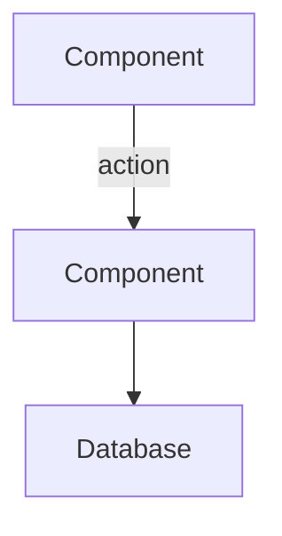

Generate architecture diagrams using Mermaid or ASCII art for system visualization.

## Steps

1. Identify the diagram type needed:
2. Gather the components to include from the codebase:
3. Map relationships between components:
4. Generate the diagram in Mermaid syntax.
5. Add labels for all connections describing what data flows.
6. Include a legend if the diagram uses custom notation.
7. Save the diagram to the appropriate docs directory.

## Format

## Rules

- Keep diagrams focused on one aspect (do not mix sequence and class diagrams).
- Limit to 15 nodes maximum per diagram for readability.
- Label every arrow with the action or data being transferred.

